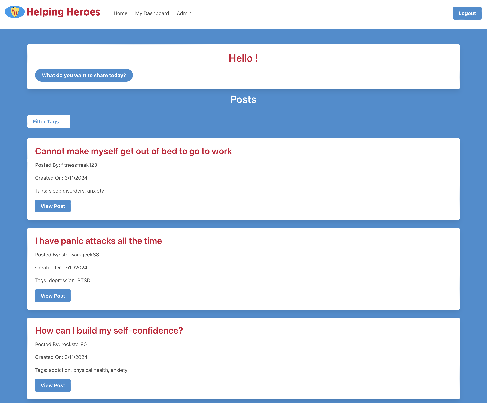

# Helping Heroes

## Description
Post-covid communities are more fragmented, people are more isolated than ever. This blog is designed to provide a supportive electronic community where *helping heroes* can provide advice and resources to others in need.

## Deployment
The app is deployed on Heroku:

<https://damp-chamber-10567-589627f31d06.herokuapp.com/>

To make full use of the app you will need to create an account.

## Use
Below is a screenshot of the home page for a logged-in user with administrative privileges.

From the home page a user can view any post and all the responses to that post. Responses that seem especially supportive or helpful can be upvoted; a user can also choose to sort the responses by the number of upvotes in order to focus on the most helpful. There is a search functionality as well.

From your dashboard you can view all of your own authored content, posts and responses. You can also create new posts from this point, and edit or delete your previous contributions.

Admins have a special page and the ability to contact (through email) any user to alert them of possible infractions of blog policies. Users have the ability to temporarily ban users or permanently delete them. They also have the ability to ban individual posts or responses that are deemed offensive or otherwise do not adhere to blog policies.

## License
This project is licensed under the terms of the [MIT license](https://opensource.org/licenses/MIT).
